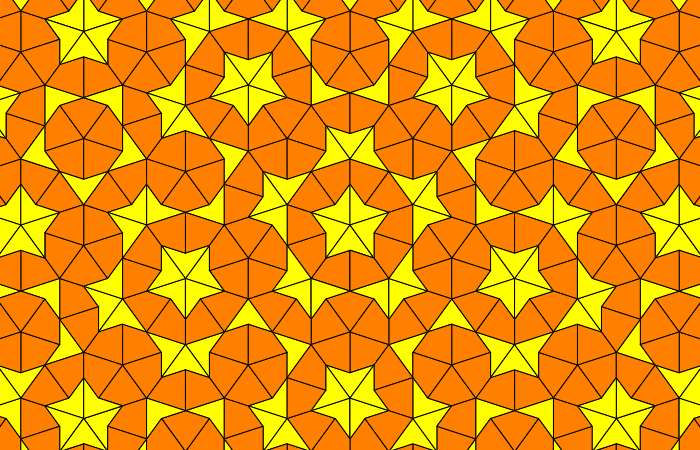

#  Penrose Tiling

Command-line implementation of [Penrose tiling](https://rosettacode.org/wiki/Penrose_tiling) in Swift. Translated mostly from the Go and Java versions.

[Great explainer on Penrose tiling.](https://preshing.com/20110831/penrose-tiling-explained/)

## Reddit r/Swift Thread

[Thread asking if there were any implementations in Swift here.](https://www.reddit.com/r/swift/comments/kwdj38/does_anyone_know_if_swifts_version_of_penrose/)

[Also nod to waterskier2007's UIKit version here.](https://gist.github.com/waterskier2007/4584bdd4c0b2f3f90e765b9a50747e48)

## Side Note: Floating Point Comparisons

I'd initially used CGFloat, then found when I switched to Double, the number of remaining tiles (all of which had to render) dropped by about a quarter. The better way to do this is with an epsilon, e.g.:

    let epsilon: CGFloat = 0.00001

…followed by comparisons like:

    abs(lhs.x - rhs.x) < epsilon

That way, numbers that are sufficiently similar will compare as equal, which helps when eliminating duplicate tiles.

So that's in the latest commit.
